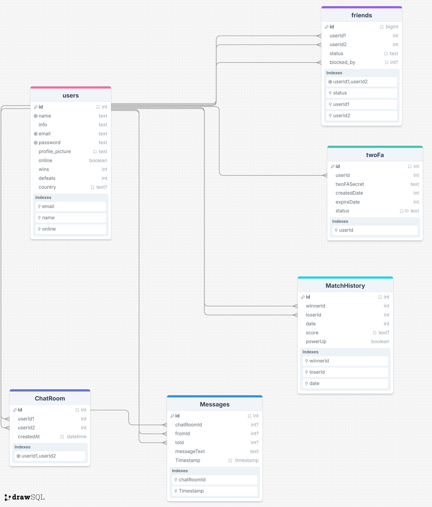

# Transcendence

*This project has been created as part of the 42 curriculum by pauberna, ajorge-p, adimas-d and divalent.*

## 📖 Description

**ft_transcendence** is a full-stack, real-time multiplayer Pong web application built as the final project of the 42 common core. The game features a 3D-rendered Pong experience powered by Babylon.js, with both local and remote multiplayer modes, a power-up system, real-time chat, a friends system, and comprehensive user management — all running inside a Dockerized architecture.

### Key Features

- 3D Pong game with Babylon.js rendering
- Real-time remote multiplayer via WebSockets
- Local multiplayer (same keyboard)
- Power-up system with 5 unique abilities
- User authentication with JWT and optional 2FA (TOTP)
- Real-time private messaging and chat rooms
- Friends system with blocking and game invitations
- Profile customization (avatar upload, paddle colors)
- Internationalization supporting 6 languages (EN, PT, DE, NO, JA, WO)
- ELK stack (Elasticsearch, Logstash, Kibana, Filebeat, Metricbeat) for monitoring and logging
- Nginx reverse proxy with HTTPS

---

## 📄 Instructions

### Prerequisites

- **Docker** and **Docker Compose** installed
- **Node.js** v22.18.0 (for local development only)
- **Make** (build automation)
- A `.env` file at the project root with the following variables:

| Variable | Description |
|----------|-------------|
| `JWT_SECRET` | Secret key for JWT signing |
| `COOKIE_SECRET` | Secret key for cookie signing |
| `PORT` | Backend port (default: `3000`) |
| `HOST` | Backend host (default: `0.0.0.0`) |
| `LOG_LEVEL` | Logging level (default: `info`) |
| `STACK_VERSION` | Elastic Stack version |
| `ELASTIC_PASSWORD` | Elasticsearch password |
| `KIBANA_PASSWORD` | Kibana system user password |
| `ES_PORT` | Elasticsearch exposed port |
| `KIBANA_PORT` | Kibana exposed port |
| `CLUSTER_NAME` | Elasticsearch cluster name |
| `LICENSE` | Elasticsearch license type |
| `ENCRYPTION_KEY` | Kibana encryption key |

### Step-by-Step: Running the Project

1. **Clone the repository:**
   ```bash
   git clone <repository-url>
   cd Transcendence
   ```

2. **Create a `.env` file** at the project root with the required variables listed above.

3. **Build and start all services:**
   ```bash
   make
   ```
   This runs `docker compose up --build -d` for the Nginx, Fastify, and SQLite services.

4. **Access the application:**
   - Frontend: `https://localhost:8081`
   - Kibana dashboard: `https://localhost:8081/kibana/`

### Other Useful Commands

| Command | Description |
|---------|-------------|
| `make up` | Start all services (foreground) |
| `make upd` | Build and start in detached mode |
| `make down` | Stop all services |
| `make downv` | Stop all services and remove volumes |
| `make logs` | View container logs |
| `make clean` | Prune containers, images, and volumes |
| `make fclean` | Full cleanup of all Docker resources |
| `make dev` | Start dev mode (live reload frontend + backend) |
| `make re` | Full restart (down with volumes + rebuild) |
| `make status` | Show running containers |

---

## 🛠️ Resources

### Documentation and References

- [Babylon.js Documentation](https://doc.babylonjs.com/) — 3D game engine used for Pong rendering
- [Fastify Documentation](https://fastify.dev/docs/latest/) — Backend framework
- [Vite Documentation](https://vite.dev/guide/) — Frontend build tool
- [Tailwind CSS Documentation](https://tailwindcss.com/docs) — Utility-first CSS framework
- [SQLite Documentation](https://www.sqlite.org/docs.html) — Database engine
- [better-sqlite3 API](https://github.com/WiseLibs/better-sqlite3/blob/master/docs/api.md) — Node.js SQLite driver
- [Elastic Stack Documentation](https://www.elastic.co/guide/index.html) — ELK stack (Elasticsearch, Logstash, Kibana, Filebeat, Metricbeat)
- [Speakeasy (TOTP)](https://github.com/speakeasyjs/speakeasy) — Two-factor authentication library
- [Nginx Documentation](https://nginx.org/en/docs/) — Reverse proxy and web server

### AI Usage

AI tools (such as ChatGPT and GitHub Copilot) were used throughout development for:

- **Debugging**: Identifying and resolving bugs in both frontend and backend code.
- **Research**: Understanding documentation, libraries, and best practices for technologies like Babylon.js, Fastify, and the ELK stack.
- **Clarification**: Answering technical questions and clarifying implementation approaches.

---

## 👤 Team Information

| Member | Role | Responsibilities |
|--------|------|------------------|
| **pauberna** | Product Owner (PO) | Defined project vision and priorities. Developed the backend, database layer, and overall project architecture. |
| **ajorge-p** | Project Manager (PM) | Managed timelines and task coordination. Developed the 3D Pong game engine and game logic. |
| **adimas-d** | Tech Lead | Led technical decisions and architecture. Implemented the entire logging and monitoring system (ELK stack). |
| **divalent** | Developer | Implemented the majority of the frontend, including UI components, routing, and user-facing features. |

---

## 🤝 Project Management

- **Task Distribution**: Work was split by feature domain — backend/database (pauberna), game/3D (ajorge-p), frontend/UI (divalent), and logging/monitoring (adimas-d).
- **Project Management Tool**: **GitHub Issues** was used to track tasks, bugs, and feature requests.
- **Communication Channels**: **WhatsApp** for daily asynchronous communication, and **in-person meetings** for discussions.
- **Meeting Frequency**:
  - Full team meetings: once a month.
  - PO and PM sync: almost every weekday.

---

## 💻 Technical Stack

### Frontend

| Technology | Purpose |
|------------|---------|
| **TypeScript** | Main programming language (vanilla, no framework) |
| **Vite** | Build tool and dev server with HMR |
| **Babylon.js** | 3D game rendering engine |
| **Tailwind CSS** | Utility-first CSS framework for styling |
| **Custom SPA Router** | Client-side routing with `history.pushState` |
| **Custom i18n System** | Internationalization for 6 languages |

### Backend

| Technology | Purpose |
|------------|---------|
| **Fastify** (Node.js) | High-performance HTTP/HTTPS server |
| **@fastify/websocket** | Real-time communication (game, chat, notifications) |
| **@fastify/jwt** + **@fastify/cookie** | Authentication (JWT in httpOnly cookies) |
| **@fastify/helmet** | Security headers (CSP, HSTS) |
| **@fastify/rate-limit** | Rate limiting (500 req/min general, 5 req/min auth) |
| **bcrypt** | Password hashing |
| **speakeasy** + **qrcode** | TOTP-based two-factor authentication |
| **xss** | Input sanitization |
| **validator** | Input validation |
| **pino** | Structured logging |

### Database

| Technology | Justification |
|------------|---------------|
| **SQLite** (via `better-sqlite3`) | Lightweight, serverless, zero-config. Ideal for a single-instance application — no separate DB server needed, fast reads with WAL mode, and simple to containerize. |

### Infrastructure

| Technology | Purpose |
|------------|---------|
| **Docker** + **Docker Compose** | Containerized multi-service deployment |
| **Nginx** | Reverse proxy, HTTPS termination, static file serving |
| **Elasticsearch** | Log storage and search engine |
| **Kibana** | Log visualization and dashboards |
| **Logstash** | Log processing pipeline |
| **Filebeat** | Container log shipping |
| **Metricbeat** | System and Docker metrics collection |

### Justification for Major Technical Choices

- **Fastify over Express**: Fastify offers better performance, built-in schema validation, and a rich plugin ecosystem.
- **Vanilla TypeScript over React/Vue**: Minimizes dependencies and gives full control over the SPA architecture, aligning with the project's educational goals.
- **Babylon.js**: A powerful, well-documented 3D engine that runs natively in browsers with WebGL, ideal for a 3D Pong game.
- **SQLite**: Perfect for this project's scale — eliminates the complexity of a client-server database while providing full SQL capabilities.

---

## 🗃️ Database Schema

### Visual Representation




### Tables and Fields

**Table users**

| Field | Type | Description |
|-------|------|-------------|
| `id` | INTEGER (PK) | Auto-increment primary key |
| `name` | TEXT (UNIQUE) | Username (3-20 chars, alphanumeric) |
| `info` | TEXT | User bio / description |
| `email` | TEXT (UNIQUE) | User email address |
| `password` | TEXT | bcrypt-hashed password |
| `profile_picture` | TEXT | Filename (default: `default.jpg`) |
| `online` | BOOL | Online status |
| `wins` | INTEGER | Total wins |
| `defeats` | INTEGER | Total defeats |
| `country` | TEXT | User country (nullable) |

**Table friends**

| Field | Type | Description |
|-------|------|-------------|
| `id` | INTEGER (PK) | Auto-increment primary key |
| `userId1` | INTEGER (FK) | Requester user ID |
| `userId2` | INTEGER (FK) | Addressee user ID |
| `status` | TEXT | `pending`, `accepted`, or `blocked` |
| `blocked_by` | INTEGER (FK) | Who initiated the block (nullable) |

**Table ChatRoom**

| Field | Type | Description |
|-------|------|-------------|
| `id` | INTEGER (PK) | Auto-increment primary key |
| `userId1` | INTEGER (FK) | First participant |
| `userId2` | INTEGER (FK) | Second participant |
| `createdAt` | DATETIME | Room creation timestamp |

**Table Messages**

| Field | Type | Description |
|-------|------|-------------|
| `id` | INTEGER (PK) | Auto-increment primary key |
| `chatRoomId` | INTEGER (FK) | Associated chat room |
| `fromId` | INTEGER (FK) | Sender user ID |
| `toId` | INTEGER (FK) | Recipient user ID |
| `messageText` | TEXT | Message content |
| `Timestamp` | DATETIME | Message timestamp |

**Table twoFa**

| Field | Type | Description |
|-------|------|-------------|
| `id` | INTEGER (PK) | Auto-increment primary key |
| `userId` | INTEGER (FK) | Associated user |
| `twoFASecret` | TEXT | TOTP secret key |
| `createdDate` | INTEGER | Creation timestamp |
| `expireDate` | INTEGER | Expiration timestamp |
| `status` | TEXT | `pending`, `enabled`, or `disabled` |

**Table MatchHistory**

| Field | Type | Description |
|-------|------|-------------|
| `id` | INTEGER (PK) | Auto-increment primary key |
| `winnerId` | INTEGER (FK) | Winning user ID |
| `loserId` | INTEGER (FK) | Losing user ID |
| `date` | INTEGER | Match timestamp |
| `score` | STRING | Final score (e.g., `11-7`) |
| `powerUp` | BOOL | Whether power-ups were enabled |

---

## ✨ Feature List

| Feature | Description | Team Member(s) |
|---------|-------------|----------------|
| **3D Pong Game** | Real-time Pong with Babylon.js 3D rendering, imported table model, cylinder ball, and configurable paddles | ajorge-p |
| **Remote Multiplayer** | WebSocket-based 1v1 with lobby system, ready-check, and matchmaking | ajorge-p, pauberna |
| **Local Multiplayer** | Same-keyboard 2-player mode (W/S and ↑/↓) | ajorge-p |
| **Power-Up System** | 5 unique power-ups: Double Points, Invisible Ball, Shrink Ball, Speed Boost Ball, Speed Boost Paddle | ajorge-p |
| **Game Customization** | Per-player paddle color picker and power-up selection in lobby | ajorge-p, divalent |
| **Pause / Suspend / Rejoin** | Pause during game; auto-suspend on disconnect with 30s rejoin window | ajorge-p, pauberna |
| **User Registration & Login** | Standard email/username + password registration with JWT authentication | pauberna |
| **Guest Mode** | Automatic guest session via cookie with customizable alias | pauberna, divalent |
| **Two-Factor Authentication** | QR-based TOTP via Speakeasy, enable/disable/verify flow | pauberna |
| **Friends System** | Send, accept, reject, remove, block, and unblock friends with real-time notifications | pauberna, divalent |
| **Real-Time Chat** | 1-on-1 private messaging in chat rooms with multi-tab UI | pauberna, divalent |
| **Game Invitations** | Invite friends to a game lobby from the friends list or chat | pauberna, ajorge-p |
| **Profile Management** | Avatar upload (PNG/JPEG/WebP), stats display (win ratio), 2FA management | pauberna, divalent |
| **Match History** | Win/loss tracking, score storage, and game history display | pauberna, divalent |
| **Internationalization** | 6 languages: English, Portuguese, German, Norwegian, Japanese, Wolof | divalent |
| **Landing Page** | Animated bouncing-ball Pong background animation | divalent |
| **SPA Routing** | Custom client-side router with `history.pushState` | divalent |
| **ELK Monitoring** | Elasticsearch + Kibana + Logstash + Filebeat + Metricbeat for logs and metrics | adimas-d |
| **Security** | Helmet CSP/HSTS, rate limiting, XSS sanitization, input validation, HTTPS | pauberna |

---

## 🧩 Modules

### Module Summary

| Module | Type | Points | Team Member(s) |
|--------|------|--------|----------------|
| Backend Framework (Fastify) | Minor | 1 | pauberna |
| Frontend Toolkit (Vanilla TS + Vite) | Minor | 1 | divalent |
| Real-Time WebSockets | Major | 2 | pauberna, ajorge-p |
| User Interaction (Friends, Chat, Invites) | Major | 2 | pauberna, divalent |
| Public REST API | Major | 2 | pauberna |
| Multiple Languages (i18n) | Minor | 1 | divalent |
| Multiple Browser Support | Minor | 1 | divalent |
| Standard User Management & Auth | Major | 2 | pauberna |
| Two-Factor Authentication (2FA) | Minor | 1 | pauberna |
| Web-Based Pong Game | Major | 2 | ajorge-p |
| Remote Players | Major | 2 | ajorge-p, pauberna |
| 3D Graphics (Babylon.js) | Major | 2 | ajorge-p |
| ELK Stack (Logging & Monitoring) | Major | 2 | adimas-d |
| **Total** | | **21** | |

### Module Details

#### Web Modules (8 pts)

- **Backend Framework — Fastify (Minor, 1pt)**: The backend is built entirely with Fastify, a high-performance Node.js framework. It handles REST API endpoints, JWT authentication, file uploads, and WebSocket connections.
- **Frontend Toolkit — Vanilla TS + Vite (Minor, 1pt)**: The frontend is a single-page application written in vanilla TypeScript, bundled with Vite for fast development and optimized production builds.
- **Real-Time WebSockets (Major, 2pts)**: WebSockets power the entire real-time layer — remote game state synchronization, live chat messaging, friend notifications, game invitations, and online status tracking.
- **User Interaction (Major, 2pts)**: A full social system including friend requests (send/accept/reject/block/unblock), 1-on-1 chat rooms, and in-game invitations via friends list or chat.
- **Public REST API (Major, 2pts)**: A complete RESTful API with endpoints for user management, friends, chat, match history, lobbies, and 2FA — all secured with JWT and rate limiting.

#### Accessibility Modules (2 pts)

- **Multiple Languages (Minor, 1pt)**: The application supports 6 languages (English, Portuguese, German, Norwegian, Japanese, Wolof) with a custom i18n system and live language switching.
- **Multiple Browser Support (Minor, 1pt)**: The application is compatible with multiple modern browsers.

#### User Management Modules (3 pts)

- **Standard User Management & Authentication (Major, 2pts)**: Full user lifecycle — registration, login, logout, profile editing, avatar upload, password hashing (bcrypt), and JWT-based session management with httpOnly cookies.
- **Two-Factor Authentication (Minor, 1pt)**: QR-based TOTP 2FA using Speakeasy. Users can enable, verify, and disable 2FA from their profile page.

#### Gaming & User Experience Modules (7 pts)

- **Web-Based Pong Game (Major, 2pts)**: A fully functional Pong game running in the browser with score tracking (first to 11), game states (countdown, playing, paused, game over), and match history recording.
- **Remote Players (Major, 2pts)**: Real-time multiplayer via WebSockets with a lobby system, ready-checks, game state synchronization, disconnect handling, and a 30-second rejoin window.
- **3D Graphics — Babylon.js (Major, 2pts)**: The game is rendered in full 3D using Babylon.js with imported `.glb` table models, cylinder ball mesh, configurable paddle meshes, and an ArcRotateCamera.

#### DevOps Modules (2 pts)

- **ELK Stack (Major, 2pts)**: Complete Elasticsearch, Logstash, Kibana, Filebeat, and Metricbeat setup for centralized logging, log visualization, and system/Docker metrics monitoring — all containerized with TLS security.

---

## 🙌 Individual Contributions

### pauberna — Product Owner (PO)

- Defined project vision, priorities, and feature roadmap
- Developed the entire **backend** with Fastify (server setup, route architecture, middleware)
- Designed and implemented the **database schema** (SQLite with better-sqlite3)
- Built the **REST API** (users, friends, chat, match history, lobby, 2FA endpoints)
- Implemented **authentication** system (JWT, bcrypt, httpOnly cookies)
- Built the **WebSocket server** for real-time communication
- Implemented **security** measures (Helmet, rate limiting, XSS sanitization, input validation, HTTPS)
- Developed **2FA** (TOTP) with Speakeasy and QR code generation
- Set up the **Docker** infrastructure and project architecture
- **Challenges**: Coordinating real-time WebSocket game state between frontend and backend; ensuring security across all API endpoints.

### ajorge-p — Project Manager (PM)

- Managed project timelines and coordinated task distribution
- Developed the entire **3D Pong game** using Babylon.js (ball physics, paddle mechanics, scoring, game states)
- Built the **remote multiplayer** system (game input/state sync via WebSockets, lobby flow)
- Implemented **local multiplayer** mode
- Created the **power-up system** (5 power-ups with cooldowns, durations, and visual effects)
- Designed game UI elements (countdown, score display, game-over screen)
- **Challenges**: Synchronizing 3D game state in real-time between two remote players; tuning ball physics and collision detection.

### divalent — Developer

- Developed the majority of the **frontend** UI and user experience
- Built the **SPA routing** system with `history.pushState`
- Implemented the **landing page** with animated Pong background
- Created the **chat window** component (multi-tab chat interface)
- Built the **friends list** UI with real-time status updates
- Implemented the **profile page** and **match history** display
- Developed the **internationalization** system with 6 language translations
- Created the **language selector** component
- Implemented **guest mode** UI flow
- **Challenges**: Building a fully functional SPA without a framework; managing complex UI state with vanilla TypeScript.

### adimas-d — Tech Lead

- Led technical architecture decisions
- Implemented the entire **ELK stack** (Elasticsearch, Logstash, Kibana, Filebeat, Metricbeat)
- Configured **Docker Compose** services for the logging infrastructure
- Set up **TLS certificates** and security for Elasticsearch
- Configured **Kibana dashboards** for log visualization
- Set up **Filebeat** for container log shipping and **Metricbeat** for system metrics
- **Challenges**: Configuring the full ELK stack with TLS security in Docker; tuning Elasticsearch for the project's logging needs.

---

## 📝 Additional Information

### Installation of Zen Browser

```bash
export XDG_DATA_HOME=/home/<user>/goinfre/flatpak/.local/share
```
```bash
export XDG_CONFIG_HOME=/home/<user>/goinfre/flatpak/.config
```
```bash
flatpak remote-add --user --if-not-exists flathub https://flathub.org/repo/flathub.flatpakrepo
```
```bash
flatpak install flathub app.zen_browser.zen
```
```bash
flatpak run app.zen_browser.zen
```

### Known Limitations

- SQLite is single-instance and not suitable for horizontal scaling.
- Self-signed HTTPS certificates will trigger browser warnings.
- WEBGL_debug_renderer_info is deprecated in Firefox and will be removed. So it gives a warning whenever you try to run Transcendance in this Browser	

### License

This project was developed for educational purposes as part of the 42 school curriculum.